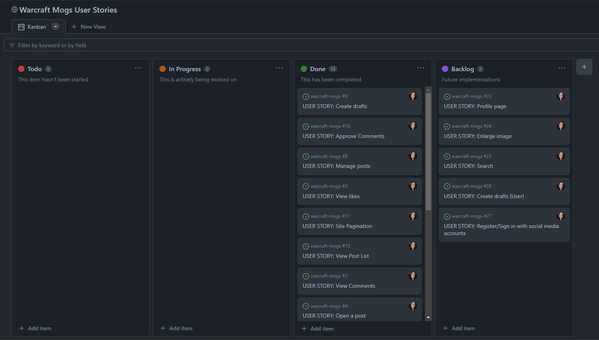
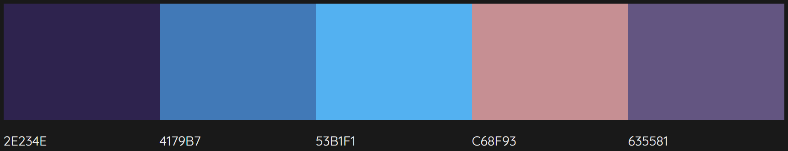
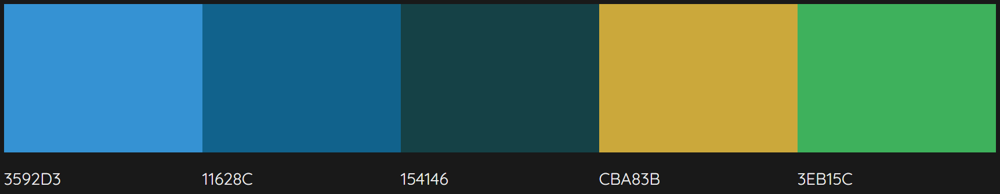
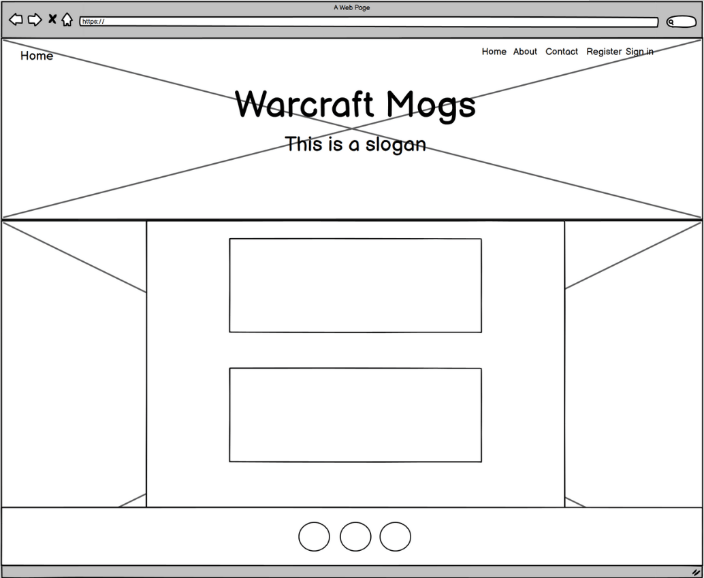

# WARCRAFT MOGS

👩🏻‍💻 View an example of this section [here](https://github.com/kera-cudmore/Bully-Book-Club#bully-book-club-website)

Add a Blurb about the site here, what does it do, why did you build it?

Add an image of the finished site here. I like to use [amiresponsive](https://ui.dev/amiresponsive) to get an image of my site on all device sizes, and amiresponsive allows you to click links on the page and scroll, so each device can show a different element of your site.

Add a link to the live site here, for Milestone 1 this will be the GitHub Pages Link from when you deployed the site.

If you want to add optional [shields.io](https://shields.io) badges to your README, I like to add them to this section.

---

## CONTENTS

* [User Experience](#user-experience-ux)

* [Agile Methodology](#agile-methodology)
  * [User Stories](#user-stories)
  * [Iterations](#iterations)
    * [Iteration 1](#iteration-1)
    * [Iteration 2](#iteration-2)
    * [Iteration 3](#iteration-3)
  * [Future Implementations](#future-implementations)

* [Design](#design)
  * [Colour Scheme](#colour-scheme)
  * [Typography](#typography)
  * [Imagery](#imagery)
  * [Wireframes](#wireframes)

* [Features](#features)
  * [General Features on Each Page](#general-features-on-each-page)
  * [Accessibility](#accessibility)

* [Technologies Used](#technologies-used)
  * [Languages Used](#languages-used)
  * [Frameworks, Libraries & Programs Used](#frameworks-libraries--programs-used)

* [Deployment & Local Development](#deployment--local-development)
  * [Deployment](#deployment)
  * [Local Development](#local-development)
    * [How to Fork](#how-to-fork)
    * [How to Clone](#how-to-clone)

* [Testing](#testing)

* [Credits](#credits)
  * [Code Used](#code-used)
  * [Content](#content)
  * [Media](#media)
  * [Acknowledgments](#acknowledgments)

---

## User Experience (UX)

👩🏻‍💻 View an example of a completed user experience section [here](https://github.com/kera-cudmore/Bully-Book-Club#user-experience-ux)

## **Agile Methodology**

The Agile Methodology was used to develop this website. It was implemented through GitHub and the Project/Kanban Board: 
[Warcraft Mogs](https://github.com/users/nicolemne/projects/3).

### User Stories

#### Iteration 1
- As a Site Admin I can create draft posts so that I can finish writing the content at a later time.
- As a Site Admin I can approve or disapprove comments so that I can filter out objectionable comments.
- As a Site Admin I can create, read, update and delete posts so that I can manage my blog content.
- As a Site User I can view a paginated list of posts so that I can select which post I want to view.
- As a user I can view all posts in a list so that I can easily find a post to view.

#### Iteration 2

- As a Site User I can click on a post so that I can read the full text. 
- As a Site User I can like or unlike a post so that I can interact with the content.
- As a Site User / Admin I can view the number of likes on each post so that I can see which post is the most popular.
- As a Site User and/or Admin I can view comments on an individual post so that I can read the conversation.  
- As a Site User I can leave comments on a post so that I can be involved in the conversation.

#### Iteration 3

- As a site user or admin I can edit/update my blog post so that I can make a change in the already submitted post.
- As a site user I can delete a blog post so that the post is removed from the blog.
- As a Site User I can register an account so that I can comment and like.
- As a site user I can upload my own post so that I can share my creation.

### Future Implementations (backlog):

With the Kanban board, the project was split into four sections;

- Todo
- In Progress
- Done
- Backlog (future additions)

<details>
<summary>Kanban board design:</summary>
<br>


</details>

## Design

👩🏻‍💻 View an example of a completed design section [here](https://github.com/kera-cudmore/earth-day-hackathon-2022#Design)

### Colour Scheme

The purple colours and aestethic has been generated from the header image.



The purple colours and aestethic has been generated from the background image.



### Typography

All fonts used were already pre-installed with the Bootstrap theme I have chose for this project;
- [Bootstrap Clean Blog](https://startbootstrap.com/theme/clean-blog)

### Imagery

All images are screenshots taken from World of Warcraft content: Copyright ©2004 Blizzard Entertainment, Inc. All rights reserved. World of Warcraft, Warcraft and Blizzard Entertainment are trademarks or registered trademarks of Blizzard Entertainment, Inc. in the U.S. and/or other countries.

The header and background image is screenshots taken from in game World of Warcraft. It is consistent throughout all pages.

Header


Background


### Wireframes

The wireframe below is the general idea and vision I had for the website. It follows a basic structure that is the same throughout all pages of the website, with small modifications. 



## Features

👩🏻‍💻 View an example of a completed user experience section [here](https://github.com/kera-cudmore/TheQuizArms#Features)

This section can be used to explain what pages your site is made up of.

### General features on each page

All pages features a navigation bar with access to the following pages: Home, About, Contact, Register, Sign in. If you are already logged in, you can access the pages Upload Post and Sign out. 
The footer is also present in all of the pages, with links to my social media accounts and GitHub. 

### Future Implementations

To expand this website further, I would like to add these future implementations:
- The ability to enlarge the images in the detailed view
- Create a user page, and the ability to view other user pages
- Search field
- Create drafts

More features and ideas may be added in the future.

### Accessibility

Be an amazing developer and get used to thinking about accessibility in all of your projects!

This is the place to make a note of anything you have done with accessibility in mind. Some examples include:

Have you used icons and added aria-labels to enable screen readers to understand these?
Have you ensured your site meets the minimum contrast requirements?
Have you chosen fonts that are dyslexia/accessible friendly?

Code Institute have an amazing channel for all things accessibility (a11y-accessibility) I would highly recommend joining this channel as it contains a wealth of information about accessibility and what we can do as developers to be more inclusive.

## Technologies Used

### Languages Used

- HTML5
- CSS
- Python
- JavaScript

### Frameworks, Libraries & Programs Used

- [Django](https://www.djangoproject.com/start/overview/)
- [PostgreSQL](https://www.psycopg.org/docs/)
- [Summernote](https://summernote.org/)
- [CrispyForms](https://django-crispy-forms.readthedocs.io/en/latest/)
- [Cloudinary](https://cloudinary.com/)
- [Colormind](http://colormind.io/)
- [Balsamiq](https://balsamiq.com/)
- [ElephantSQL](https://www.elephantsql.com/)
- [Heroku](https://dashboard.heroku.com/login)
- [Bootstrap Clean Blog](https://startbootstrap.com/theme/clean-blog)
- [Canva](https://www.canva.com/)

## Deployment & Local Development

### Deployment

The site was deployed using Heroku, following the steps offered by Code Institute.
You can find the instructions in a Google Docs [here](https://docs.google.com/document/d/1P5CWvS5cYalkQOLeQiijpSViDPogtKM7ZGyqK-yehhQ/edit#heading=h.5s9novsydyp1).

### 1. Creating the Django Project:

- Install Django and gunicorn: `pip3 install django gunicorn`
- Install supporting database libraries dj_database_url and psycopg2 library: `pip install dj_database_url psycopg2`
- Install Cloudinary libraries to manage static files: `pip install dj-3-cloudinary-storage`
- Create file for requirements: `pip freeze --local > requirements.txt`
- Create project: `django-admin startproject project_name`
- Create app: `python manage.py startapp app_name`
- Add app to list of `installed apps` in settings.py file: `'app_name'`
- Migrate changes: `python manage.py migrate`
- Test server works locally: `python manage.py runserver`

### 2. Create your Heroku App:

- Navigate to the Heroku website
- Create a Heroku account by entering your email address and a password (or login if you have one already).
- Activate the account through the authentication email sent to your email account
- Click the new button on the top right corner of the screen and select create a new app from the dropdown menu.
- Enter a unique name for the application.
- Select the appropriate region for the application.
- Click create app
- In the Heroku dashboard click on the Resources tab
- Scroll down to Add-Ons, search for and select 'Heroku Postgres'
- In the Settings tab, scroll down to 'Reveal Config Vars' and copy the text in the box beside DATABASE_URL.

### 3. Set up Environment Variables:

- In you IDE create a new env.py file in the top level directory
- Add env.py to the .gitignore file
- In env.py import the os library
- In env.py add `os.environ["DATABASE_URL"]` = "Paste in the text link copied above from Heroku DATABASE_URL"
- In env.py add `os.environ["SECRET_KEY"]` = "Make up your own random secret key"
- In Heroku Settings tab Config Vars enter the same secret key created in env.py by entering 'SECRET_KEY' in the box for 'KEY' and your randomly created secret key in the 'value' box.

### 4. Setting up settings.py
- In your Django 'settings.py' file type:

```
from pathlib import Path
import os
import dj_database_url

if os.path.isfile("env.py"):
    import env
```

- Remove the default insecure secret key in settings.py and replace with the link to the secret key variable in Heroku by typing: SECRET_KEY = os.environ.get(SECRET_KEY)
- Comment out the DATABASES section in settings.py and replace with:

```
DATABASES = {
  'default': 
  dj_database_url.parse(os.environ.get("DATABASE_URL"))
  }
```

- Create a Cloudinary account and from the 'Dashboard' in Cloudinary copy your url into the env.py file by typing: `os.environ["CLOUDINARY_URL"] = "cloudinary://<insert-your-url>"`
- In Heroku add cloudinary url to 'config vars'
- In Heroku config vars add DISABLE_COLLECTSTATIC with value of '1' (note: this must be removed for final deployment)
- Add Cloudinary libraries to the installed apps section of settings.py file:
```
'cloudinary_storage'
'django.contrib.staticfiles''
'cloudinary'
```

- Connect Cloudinary to the Django app in settings.py:

```
STATIC_URL = '/static'
STATICFILES_STORAGE = 'cloudinary_storage.storage.StaticHashedCloudinaryStorage'
STATICFILES_DIRS = [os.path.join(BASE_DIR, 'STATIC')]
STATIC_ROOT = os.path.join(BASE_DIR, 'staticfiles')
MEDIA_URL = '/media/'
DEFAULT_FILE_STORAGE =
'cloudinary_storage.storage.MediaCloudinaryStorage'
* Link file to the templates directory in Heroku 
* Place under the BASE_DIR: TEMPLATES_DIR = os.path.join(BASE_DIR,
'templates')
```

- Change the templates directory to TEMPLATES_DIR. Place within the TEMPLATES array: `'DIRS': [TEMPLATES_DIR]`
- Add Heroku Hostname to ALLOWED_HOSTS: `ALLOWED_HOSTS = ['rhi-book-nook.herokuapp.com', 'localhost']` *Create Procfile at the top level of the file structure and insert the following: web: gunicorn PROJECT_NAME.wsgi
- Make an initial commit and push the code to the GitHub Repository. `git add . git commit -m "Initial deployment" git push`

### 5. Heroku Deployment:
- Click Deploy tab in Heroku
- In the 'Deployment method' section select 'Github' and click the 'connect to Github' button to confirm.
- In the 'search' box enter the Github repository name for the project
- Click search and then click connect to link the heroku app with the Github repository. The box will confirm that heroku is connected to the repository.

### 6. Final Deployment
In the IDE:

- When development is complete change the debug setting to: DEBUG = False in settings.py
- In Heroku settings config vars change the DISABLE_COLLECTSTATIC value to 0
- Because DEBUG must be switched to True for development and False for production it is recommended that only manual deployment is used in Heroku.
- To manually deploy click the button 'Deploy Branch'. The default 'main' option in the dropdown menu should be selected in both cases. When the app is deployed a message 'Your app was successfully deployed' will be shown. Click 'view' to see the deployed app in the browser.

### Local Development

#### How to Fork

1. Login (or sign up) to GitHub.
2. Go to the repository for this project [here](https://github.com/nicolemne/warcraft-mogs)
3. Click the Fork button in the top right corner.

#### How to Clone

If you wish to clone my project, please see the following steps below:

- Navigate to GitHub: https://github.com/nicolemne/warcraft-mogs
- Select the 'Clone' button
- Copy the URL or download it as a ZIP file
- Use git clone + the URL in your terminal, or unpack the ZIP containing the project


## Testing

Please refer to the [TESTING.md](TESTING.md) file for all testing performed.

## Credits

- [Django Model Meta Options](https://docs.djangoproject.com/en/4.2/ref/models/options/)
- [Django Slug Tutorial](https://learndjango.com/tutorials/django-slug-tutorial)
- [Class Based Generic Views Django](https://www.geeksforgeeks.org/class-based-generic-views-django-create-retrieve-update-delete/)
- [Bootstrap Forms](https://getbootstrap.com/docs/4.0/components/forms/)
- [Verbose Name](https://stackoverflow.com/questions/636905/django-form-set-label)

#### UploadPost view:
My friend Joseph has provided me with pointers and help for my Upload Blog Post feature that was not working. These links were a part of the solution.
- [Python super() Function](https://www.w3schools.com/python/ref_func_super.asp)
- [Stackoverflow - We use super().form_valid(form)](https://stackoverflow.com/questions/66248147/could-someone-explain-why-we-return-super-form-validform-in-form-valid-metho)
- [Stackoverflow - Submit a post/article](https://stackoverflow.com/questions/45775435/modelform-with-user-being-request-user)
- [Django Accessing “clean” data](https://docs.djangoproject.com/en/4.2/ref/forms/api/)
- [Why a while loop instead of a for loop](https://support.khanacademy.org/hc/en-us/articles/203327020-When-do-I-use-a-for-loop-and-when-do-I-use-a-while-loop-in-the-JavaScript-challenges-)
- [Django.utils.crypto (get_random_string())](https://docs.djangoproject.com/en/3.2/topics/auth/passwords/#module-django.utils.crypto)
- [Django.utils.text (slugify)](https://docs.djangoproject.com/en/3.2/ref/utils/#django.utils.crypto.get_random_string)

### Code Used

From the "I Think Therefore I blog" project I've used a lot of inspiration and a bit of code: 
- Post & Comment Models

From a comment on [Stackoverflow](https://stackoverflow.com/questions/2662039/keep-background-image-fixed-during-scroll-using-css):
- Fixed background image 

From Codemy "Create a Simple Blog with Python and Django" [video playlist](https://www.youtube.com/playlist?list=PLCC34OHNcOtr025c1kHSPrnP18YPB-NFi):
- Set up Categories, Edit & Delete post

### Content

I have written all code in this project myself, of course with the help of different resources such as those named in the Credits and Code Used. Tutor Support, as well as two fellow coder friends - Emelie and Joseph has assisted me when I have been stuck and needed guidance.

###  Media

If you have used any media on your site (images, audio, video etc) you can credit them here. I like to link back to the source where I found the media, and include where on the site the image is used.
  
###  Acknowledgments

I would like to thank and acknowledge the following people, who have shown invaluable support throughout my fourth project:

- Dan Ford, boyfriend and biggest supporter.
- Mitko Bachvarov, my mentor at Code Institute, for the great help and support with my project.
- Joseph Doble, for providing help with sources and helping me with easy-to-understand explanations of how things work and why.
- Emelie Hansson, fellow Code Insitute student whom I've had a lot of support from. 
- Kera Cudmore, for the README and TESTING template.